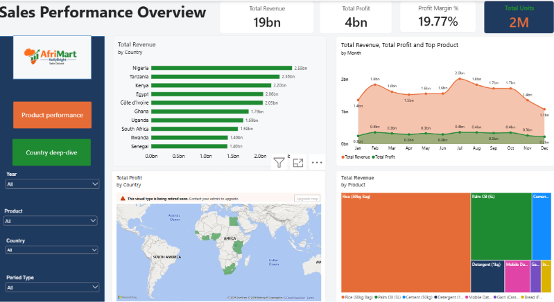

# AfriMart-KollyBright-SalesDashboard

## Project Overview
 AfriMart KollyBright sells everyday products across Africa. This project answers business questions such as:

- Which countries and products drive the most revenue and profit?
- Which products have the best and worst margins?
- How do sales change over time and compared with last year?
- How do actual sales compare with projected figures?

This project was created as part of a data analysis portfolio to demonstrate my ability to take a raw business dataset through the full analytics workflow: cleaning the data, modelling it, and presenting the insights in an interactive dashboard that a decision-maker can use.

### Skills demonstrated

- **Data cleaning and preparation:** combining multiple sheets, fixing data types, removing blanks, checking for duplicates and validating calculations in Power Query
- **Data modelling:** building a date table and relationships in Power BI
- **DAX:** writing measures for totals, margins, year-on-year comparisons and conditional KPI arrows
- **Data visualisation and design:** choosing the right chart for each question, using a consistent brand colour theme, and keeping layouts clean and readable
- **Interactivity:** synced slicers, cross-filtering, drill-through, tooltips and page navigation
- **Business insight:** turning figures into clear findings about products, countries and margins
- **Documentation:** explaining the process and assumptions so others can follow the work

---
## Key KPIs

- Total Revenue
- Total Cost
- Total Profit
- Profit Margin %
- Total Units Sold
- Average Revenue per Unit
- Top Product
- Best Margin Product
- Lowest Margin Product
- Top Country (Revenue)
- Top Country (Profit)
- Best Margin Country

---
## Tools Used

- Power BI Desktop
- Power Query
- DAX
- Microsoft Excel
- GitHub

---
## Dashboard Preview

---
## Key Insights

Key Insights

- Rice (50kg Bag) generates about 60% of total revenue, but it has the lowest margin at about 15.6%.
- Rice, Palm Oil and Cement together account for about 88% of revenue.
- Mobile Data Bundle has the highest margin at 40%, followed by Garri at 33.3%, but it contributes very little revenue.
- Detergent sells the most units, yet it ranks fourth in revenue.
- Nigeria is the top country by revenue and by profit, followed by Tanzania and Kenya.
- Nigeria and Tanzania have the lowest margins, at about 19%.
- Country margins sit in a narrow band of about 19% to 21%, because margin depends on product mix and not on country.
- Overall profit margin is about 20%.
- Revenue grew about 23% from 2024 to 2025.
- July is the strongest sales month

---
## Files in this Repository
- [Sales Dataset](012_AfriMart_KollyBright_Sales_Dataset.xlsx)
- [PowerBI Report File](AfriMart-KollyBright-Sales-Dashboard.pbix)
- [Sale Performance Dashboard Screenshots](AfiMart-Sales-Performance-Overview.png)
- [Product Performance Dashboard Screenshot](AfriMart-Product-Performance-Dashboard)
- [Country Deep-dive Dashboard Screenshot](AfriMart-Country-Deepdive)
- [Company Logo](logo_afrimart-logo.png)
- README.md

---
## Conclusion

This project took the AfriMart KollyBright sales data from raw Excel sheets to an interactive Power BI dashboard, using Power Query for cleaning and DAX for modelling. The analysis shows that Rice drives about 60% of revenue but has the lowest margin, while higher-margin products like Mobile Data Bundle contribute little. Growing profit means promoting higher-margin products and reviewing Rice pricing and costs.

